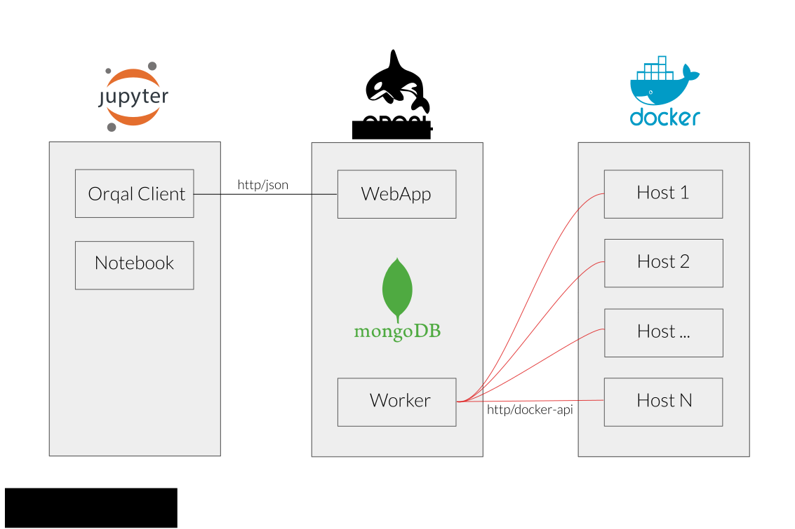
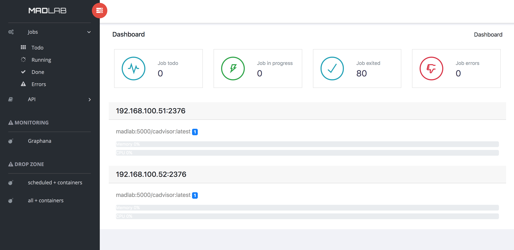

 

Orqal for [ORQ]chestration of [AL]gorithms is a simple batch scheduler for docker cluster which can be used remotly and without overhead in scientific experiment.

## 📐 Design

### Overview
	Orqal claim to be and stay as simple as possible. 


- We use the docker api to manage docker nodes, which means that there is **no configuration** on node except open the api port. 
- **HTTP/REST API** enable to schedule jobs and retrieve data.
- A **dashboard** is provided to monitor load average per nodes, jobs scheduling and redoc api.



### Wrapper

The glue between docker image and orqal need to be implemented in python with the ArbstractWorker class in order to :
- get command to execute
- set the result if necessary

Here is a simple example using radare2 

	
```python
class Rabin2(AbstractWorker):
    docker_url = "radare/radare2"
    volumes = {'/database': {'bind': '/database', 'mode': 'ro'}}
    threads = 1
    memory_in_gb = 1
	
    def get_cmd(self, params):
        return "rabin2 -I %s" % self.job.input
	
    def set_result(self, job):
        r = {l.split()[0].replace('.', '_'): l.split()[1] for l in job.stdout if len(l.split()) == 2}
        job.set_result(r)
```

## Install 

A docker-compose file can be used as receipe to install it.

⚠️ work in progress


### Setup log collection in Mongo 

    use orqal
    db.createCollection('log', {capped:true, size:10000000}) 
    db.log.createIndex( { "time": 1 }, { expireAfterSeconds: 86400 } )

## Run 

1 - Web process

    gunicorn app:app --bind 0.0.0.0:5001 --worker-class aiohttp.GunicornWebWorker  --workers 8


2 - Worker 

	python3 worker.py 
	


## Compile Client

```	
   python setup.py bdist
   python3 setup.py sdist
   twine upload dist/*
```

### Licence

GNU AFFERO GENERAL PUBLIC LICENSE
https://www.gnu.org/licenses/agpl-3.0.txt

### Credits 

- Dashboard template : https://github.com/puikinsh/sufee-admin-dashboard
- Font : https://fonts.google.com/specimen/Righteous

### How to open api port on docker:

Add in file `/etc/systemd/system/docker.service.d/override.conf`

    [Service]
    ExecStart=
    ExecStart=/usr/bin/docker daemon -H fd://  -H tcp://0.0.0.0:2376 -s overlay --insecure-registry orqal:5000
    

Then flush changes by executing :
    
    systemctl daemon-reload

verify that the configuration has been loaded:
    
    systemctl show --property=ExecStart docker

restart docker:
    
    systemctl restart docker


### Clean old jobs

Add a index (7 days here):

	db.jobs.createIndex( { "ctime": 1 }, { expireAfterSeconds: 604800 } )

And call http://<server>/api/clean/old periodically in order to delete old job directories.

