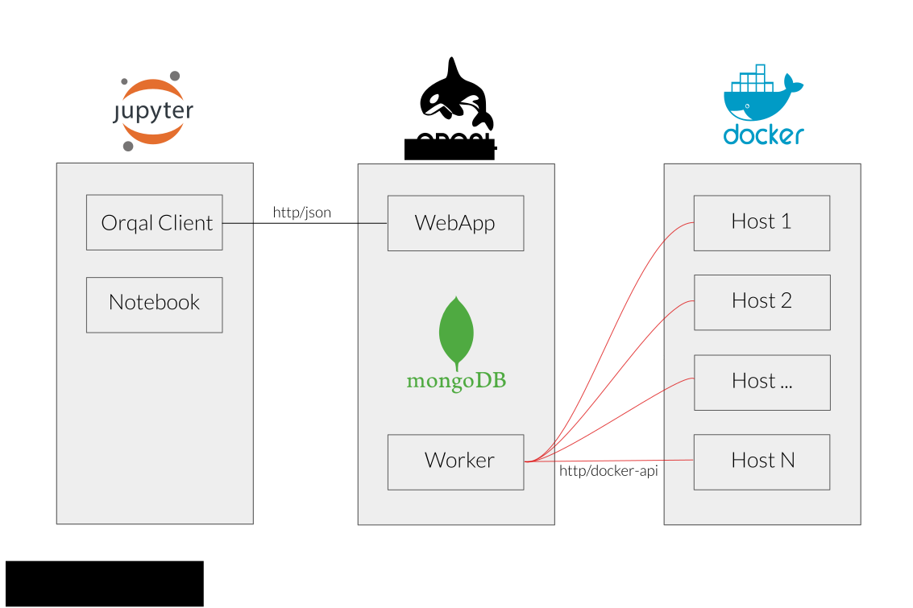
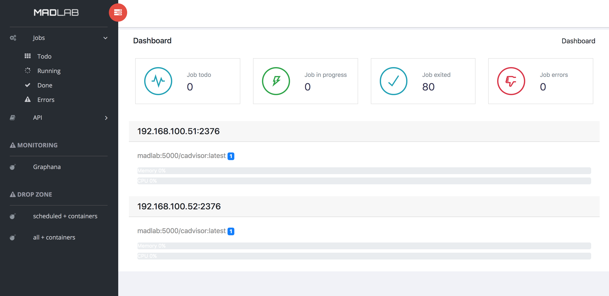

 

Orqal for [ORQ]chestration of [AL]gorithms is a simple batch scheduler for docker cluster which can be used remotly and without overhead in scientific experiment.

## 📐 Design

### Overview
	Orqal claim to be and stay as simple as possible. 


- We use the docker api to manage docker nodes, which means that there is **no configuration** on node except open the api port. 
- **HTTP/REST API** enable to schedule jobs and retrieve data.
- A **dashboard** is provided to monitor load average per nodes, jobs scheduling and redoc api.



### Wrapper

The glue between docker image and orqal need to be implemented in python with the ArbstractWorker class in order to :
- get command to execute
- set the result if necessary

Here is a simple example using radare2 

	
```python
class Rabin2(AbstractWorker):
    docker_url = "radare/radare2"
    volumes = {'/database': {'bind': '/database', 'mode': 'ro'}}
    threads = 1
    memory_in_gb = 1
	
    def get_cmd(self, params):
        return "rabin2 -I %s" % self.job.input
	
    def set_result(self, job):
        r = {l.split()[0].replace('.', '_'): l.split()[1] for l in job.stdout if len(l.split()) == 2}
        job.set_result(r)
```

## Install 

    pip3 install orqal 

## Run 


Start the web worker : 

    orqal-worker


Start the web interface : 

    orqal-web
    
NB: In a production mode, use gunicorn, in orqal dir : 

    gunicorn3 web:app --bind 0.0.0.0:5001 --worker-class aiohttp.GunicornWebWorker --workers 8 --timeout 120
user


    

## Configuration 

In order to establish a DB connection, process will search the following environment variable : 
    
    ORQAL_MONGO_URI

By default :  'mongodb://localhost/'

Other settings will be loaded from the conf collection, using the request : active=True

Here is a example : 

`NB : The first run will initiate it if necessary`

```json
    {
        "_id" : ObjectId("5d1a78eca307b20dd5a660ce"),
        "active" : true,
        "mongourl" : "mongodb://localhost/",
        "docker_hosts" : [ 
            "192.168.100.51:2376", 
            .....
            "192.168.100.64:2376"
        ],
        "docker_api_version" : "1.37",
        "mongo_replicaset" : "madlabReplSet",
        "registry_auth_config" : {
            "password" : "65sX2-9sSXSp-hs-XeZ8",
            "username" : "test"
        },
        "services" : "/home/madlab/services.py",
        "nb_disp_jobs" : 30,
        "contact" : "orqal@example.com",
        "jobs_dir" : "/scratch/jobs"
    }
```


## Services

The python module is defined in the configuration (see services above)

Here is a example : 

```python
import json
import logging
import conf
import os
from orqal.abstract import AbstractWrapper

class TestProd(AbstractWrapper):
    docker_url = "madlab:5000/test_module"

    def get_cmd(self, params):
        return "python3 simple_job.py %s %s %s" % (params['echo'], params['time'], params['exit_code'])

    def set_result(self, job):
        job.set_result("My results")


class AngrExtraction(AbstractWrapper):
    docker_url = "madlab:5000/scdg/madlab-v2"
    threads = 1
    memory_in_gb = 10
    create_dir = True

    def get_cmd(self, params):
        return "python /code/src/interfaces/cli.py %s params.json -o calls.json" % self.job.input

    def set_result(self, job):
        return os.path.join(self.job.wd, "calls.json")
```


### DB tuning : log collection in Mongo 

Process use a mongo logging handler, in order to provide it in the web interface, you can customize parameters like that : 

    use orqal
    db.createCollection('log', {capped:true, size:10000000}) 
    db.log.createIndex( { "time": 1 }, { expireAfterSeconds: 86400 } )


## Distribution

```	
   python setup.py bdist
   python3 setup.py sdist
   twine upload dist/*
```

### Licence

GNU AFFERO GENERAL PUBLIC LICENSE
https://www.gnu.org/licenses/agpl-3.0.txt

### Credits 

- Dashboard template : https://github.com/puikinsh/sufee-admin-dashboard
- Font : https://fonts.google.com/specimen/Righteous

### FAQ 
#### How to open api port on docker ?

Add in file `/etc/systemd/system/docker.service.d/override.conf`

    [Service]
    ExecStart=
    ExecStart=/usr/bin/docker daemon -H fd://  -H tcp://0.0.0.0:2376 -s overlay --insecure-registry orqal:5000
    

Then flush changes by executing :
    
    systemctl daemon-reload

verify that the configuration has been loaded:
    
    systemctl show --property=ExecStart docker

restart docker:
    
    systemctl restart docker


### Clean old jobs

Add a index (7 days here):

	db.jobs.createIndex( { "ctime": 1 }, { expireAfterSeconds: 604800 } )

And call http://<server>/api/clean/old periodically in order to delete old job directories.

